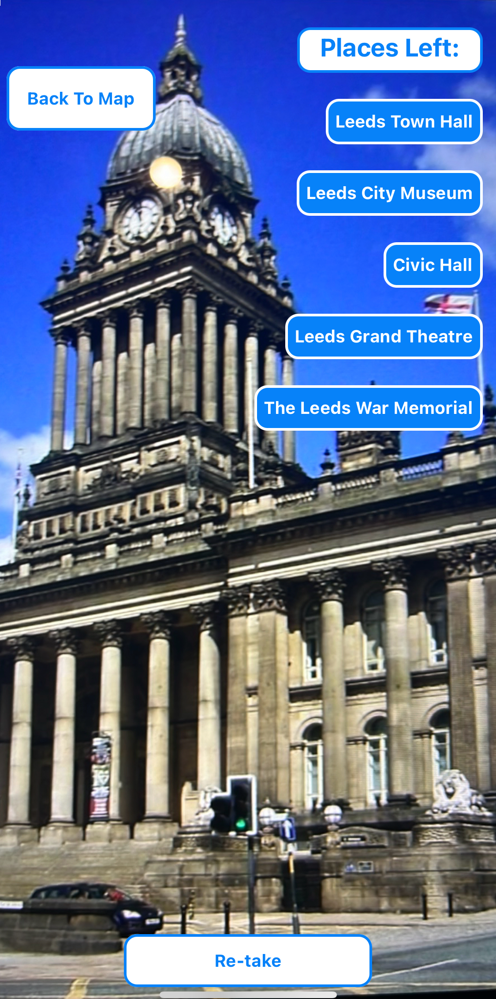

# LeedsYouAround

### Welcome to LeedsYourAround! ###

LeedsYouAround is a landmark based scavenger hunt set in the Leeds area. It requires the player to reach the sights using the integrated map and snap a picture which will validate and tick them off.

The app was developed for a final team project on the Northcoders Software Development course by Phil Barlow, Dan Marongiu, Greg Munden and Michael Stent. With some of the team being new to Leeds, we wanted a fun way to get to know the city so came up with the idea of this app.

For more information, along with a walkthrough of the app, please visit the project page on the Northcoders website - 

https://northcoders.com/project-phase/leedsyouaround

## Install

To start using this project, please first clone the repository from GitHub using the following command

    git clone https://github.com/EpicIssues/Leeds-You-Around.git

Next you'll need to install the dependencies using 

    npm install

In order to get the app running on your device, you'll need to download Expo Go for either iOS or Android. Links for both apps can be found here - 

https://expo.dev/go

Once the app is installed, run the following in the terminal

    npx expo start

You should see a QR code appear so use this to launch the app in Expo Go.

Once launched, login or register to proceed to the level selector screen. Here you can choose between 3 different levels, each containing 5 different landmarks. When you click start, the timer and tracking will start and you'll be taken to the map screen where you can see the locations left to reach on the map. 

When you reach one of the loactions, press the Camera button, aim at the landmark and then take a picture. If you're successful then the landmark will be removed from the list and you can continue on to the next one. If not then you can try and retake the photo.

After all the landmarks are photographed, you'll get some celebratory confetti and then be taken to a completion screen. You can then return to try your hand at a different level.

## Technologies Used

-   NodeJS - https://nodejs.org/en (minimum version 20.10.0)
-   npm - https://www.npmjs.com/ (minimum version 10.5.0)
-   React Native - https://reactnative.dev/ (minimum version 0.73.6)
-   React Native Maps - https://www.npmjs.com/package/react-native-maps (minimum version 1.10.0)
-   React Native Dotenv - https://www.npmjs.com/package/react-native-dotenv (minimum version 3.4.11)
-   React Navigation - https://reactnavigation.org/ (minimum version 6.1.17)
-   Expo - https://expo.dev/ (minimum version )
-   Expo Camera - https://docs.expo.dev/versions/latest/sdk/camera/ (minimum version 14.1.1)
-   Expo File System - https://docs.expo.dev/versions/latest/sdk/filesystem/ (minimum version 16.0.8)
-   Expo Location - https://docs.expo.dev/versions/latest/sdk/location/ (minimum version 16.5.5)
-   Expo Status-bar - https://docs.expo.dev/versions/latest/sdk/status-bar/ (minimum version 1.11.1)
-   Axios - https://axios-http.com/(minimum version 1.6.8)
-   Firebase - https://firebase.google.com/ (minimum version 10.9.0)
-   Lottie React Native - https://www.npmjs.com/package/lottie-react-native (minimum version 6.7.0)
-   Watchman - https://facebook.github.io/watchman/docs/install (minimum version 1.0.0)
-   Viro - https://viro-community.readme.io/

